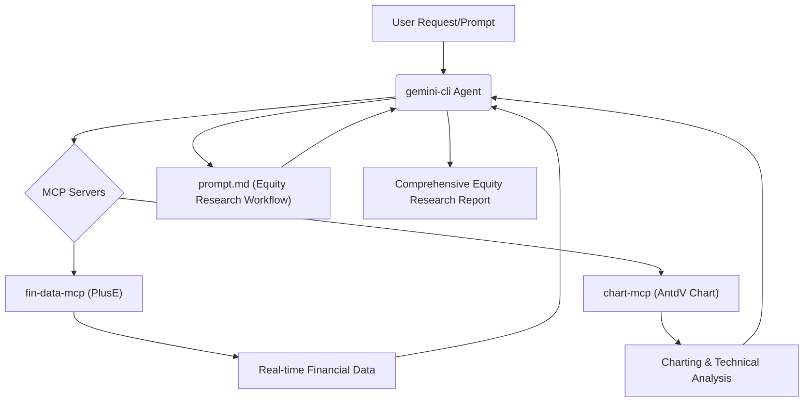

# From Vibe Coding to Vibe Trading: An AI-Powered Equity Research Agent

> Transform your AI agent from a general "vibe coding" tool into a sophisticated "vibe trading" analyst by integrating real-time market data and advanced charting capabilities.

This project demonstrates how to leverage the `gemini-cli` as an AI agent, augmented with specialized Model Context Protocol (MCP) servers and a detailed prompt, to perform comprehensive equity research and generate actionable investment recommendations. It showcases the power of "vibe trading" – articulating clear intent and context to an AI to execute complex financial analysis tasks.

## Project Goal

The primary goal of this demo is to illustrate how a versatile AI agent like `gemini-cli` can be specialized for financial analysis by:
1.  Integrating with real-time financial market data sources.
2.  Incorporating data visualization and charting tools.
3.  Guiding its analysis with a highly structured and domain-specific prompt.

This transformation enables the AI to act as an "equity research analyst," providing in-depth reports and investment insights.

## Architecture

The system's architecture is centered around the `gemini-cli` agent, which orchestrates tasks by interacting with external MCP servers and following a predefined analytical workflow.

## Key Components

### 1. `gemini-cli` Agent

The `gemini-cli` serves as the core AI agent. It is a powerful, open-source command-line interface tool that understands natural language prompts, can interact with codebases, and is highly extensible through MCP server integrations. In this project, it acts as the "brain" that processes the research prompt, queries data, generates charts, and synthesizes the final report.

### 2. PlusE MCP Server (`fin-data-mcp`)

Configured in [.gemini/settings.json](.gemini/settings.json), the `fin-data-mcp` connects to `https://plusefin.com`. This server provides the `gemini-cli` with access to real-time financial market data, including:
*   Company financials (income statements, balance sheets, cash flow statements)
*   Key financial ratios and valuation multiples
*   Stock prices and volume data

This data is crucial for the agent's fundamental and market performance analysis.

### 3. AntdV Chart MCP Server (`chart-mcp`)

Also configured in [.gemini/settings.json](.gemini/settings.json) using `npx @antv/mcp-server-chart`, this server empowers the `gemini-cli` with robust data visualization capabilities. It allows the agent to:
*   Generate various financial charts (e.g., candlestick, volume charts).
*   Visualize technical indicators (e.g., moving averages, RSI, MACD).

These visualizations are essential for performing technical analysis and presenting findings clearly in the research report.

### 4. `prompt.md`

This markdown file contains the detailed instructions and analytical workflow for the `gemini-cli` agent. It defines the agent's role as a "world-class equity research analyst" and outlines a comprehensive five-part analysis:
*   **Part 1:** Fundamental Business & Financial Health Analysis
*   **Part 2:** Market Performance & Technical Analysis
*   **Part 3:** Industry Landscape & Competitive Analysis
*   **Part 4:** Qualitative Factors & Future Outlook
*   **Part 5:** Synthesis & Actionable Recommendation

The `prompt.md` acts as the "vibe" or "intent" that guides the AI's entire research process, ensuring a structured and thorough output.

## How It Works

1.  **Initialization:** The `gemini-cli` is launched, loading its configuration from [.gemini/settings.json](.gemini/settings.json), which includes the MCP server integrations.
2.  **Prompt Ingestion:** The `gemini-cli` receives the `prompt.md` as its primary instruction set, defining the scope and methodology of the equity research.
3.  **Data Gathering:** The agent uses the `fin-data-mcp` to fetch real-time financial data for the specified company (e.g., Cameco). It may also use general web search tools (like Tavily, if integrated) for industry and qualitative analysis.
4.  **Analysis & Visualization:** The `gemini-cli` processes the gathered data according to the `prompt.md` workflow. It utilizes the `chart-mcp` to generate relevant graphs and technical indicators for market performance analysis.
5.  **Report Generation:** The agent synthesizes all the information, analysis, and visualizations into a structured markdown report, culminating in a core investment thesis, valuation judgment, and actionable advice.

## Example Output

An example of the output generated by this system is provided in [Cameco_Equity_Research_Report_2025-10-07.md](Cameco_Equity_Research_Report_2025-10-07.md), which showcases a detailed equity research report for Cameco Corporation.

## Setup and Usage

To run this demo:
1.  Ensure `gemini-cli` is installed and configured.
2.  Verify that the [.gemini/settings.json](.gemini/settings.json) file correctly points to the PlusE and AntdV Chart MCP servers. You may need to replace `YourApiKey` with a valid API key for the PlusE server.
3.  Execute the `gemini-cli` with the `prompt.md` file, specifying the target ticker (e.g., `Cameco`).

This project provides a clear blueprint for building specialized AI agents that can perform complex, real-world tasks by combining powerful language models with domain-specific tools and precise instructions.
